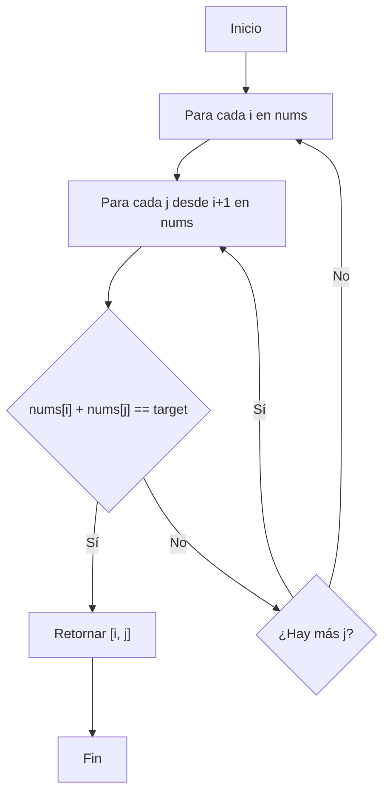
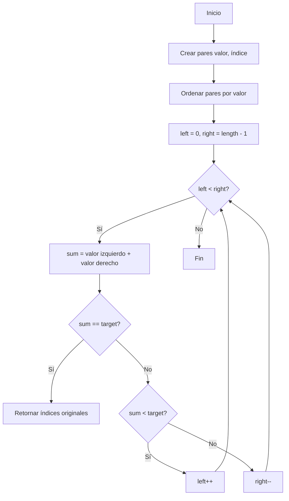

# Two-Sum

Two Sum es el primer desafío de Leet Code. El problema nos indica que dado un array de enteros, debemos retornar los índies de los dos números que conforman al target.

```text
Given an array of integers nums and an integer target, return indices of the two numbers such that they add up to target.

You may assume that each input would have exactly one solution, and you may not use the same element twice.

You can return the answer in any order.

Example :

Input: nums = [2,7,11,15], target = 9
Output: [0,1]
Explanation: Because nums[0] + nums[1] == 9, we return [0, 1].
Example 2:

Input: nums = [3,2,4], target = 6
Output: [1,2]
Example 3:

Input: nums = [3,3], target = 6
Output: [0,1]

```

## Primer approach: Fuerza bruta

Recordemos que la **fuerza bruta** consiste en probar todas las soluciones posibles hasta que se encuentre la correcta. Siemple pero ineficiente.


### Diagrama de flujo: Enfoque de Fuerza Bruta


### Análisis del enfoque inicial:

- **Complejidad temporal**: O(n²), donde n es el tamaño del array.
- **Complejidad espacial**: O(1), ya que no utilizamos estructuras de datos adicionales.
- **Lógica**: Para cada elemento del array, comparamos con todos los elementos siguientes.
- **Ventajas**: Simple de implementar y comprender.
- **Desventajas**: Ineficiente para arrays grandes.

### Solución
```javascript
var twoSum = function(nums, target) {
    for(i=0; i < nums.length; i++) {
        const a = nums[i]
        for(j=i+1; j < nums.length; j++){
            const b = nums[j]
            if (a + b === target) { return [i, j] }
        }
    }
}
```

## Segundo approach: Hash Map
En este caso intentaremos resolver el problema con una estructura de datos diferente, con la estructura Hash Map.

Un Hash Map es una estructura de almacenamiento de pares **claves-valor**, la magia ocurre cuando se utiliza la **función hash** para calcular donde se almacenará cada elemento.

### Ventajas:
Permite buscar, insertar y eliminar elementos en tiempo promedio constante (**O(1)**).

Volviendo al problema, veremos como se aplicaría la función hash.
<div align="center" width="50%">
 
</div>

El algoritmo sería:
 1) Se inicia.
 2) Debemos crear un Map vacío.
 3) Por cada i (índice) en nums, calculamos el complemento (target - nums).
 4) El complemento está en el Map? Si sí, retornamos el complemento, sino añadimos el índice al Map.

Utilizando el test case de la imagen:

Recordemos: nums = [3, 2, 4], target = 6

Paso 1: i = 0, nums[i] = 3
  - complemento = 6 - 3 = 3
  - Map está vacío -> Añadir 3->0 al Map
  - Map ahora: {3: 0}

Paso 2: i = 1, nums[i] = 2
  - complemento = 6 - 2 = 4
  - 4 no está en Map -> Añadir 2->1 al Map
  - Map ahora: {3: 0, 2: 1}

Paso 3: i = 2, nums[i] = 4
  - complemento = 6 - 4 = 2
  - 2 está en Map con valor 1
  - Retornar [1, 2]

### Solución

```javascript
var twoSum = function(nums, target) {
    const map = new Map();
    
    for (let i = 0; i < nums.length; i++) {
        const complemento = target - nums[i];
        
        if (map.has(complemento)) {
            return [map.get(complemento), i];
        }
        
        map.set(nums[i], i);
    }
    
    return null;
};
```

## Tercer approach: Dos punteros

Recordemos que **dos punteros** significa: "recorrer el array desde ambos extremos hacia adentro".
IMPORTANTE: el array debe estar ORDENADO.



Utilizando el siguiente ejemplo: 

nums = [3, 2, 4], target = 6

Paso 1: Crear pares
  - pairs = [[3,0], [2,1], [4,2]]

Paso 2: Ordenar pares
  - pairs = [[2,1], [3,0], [4,2]]
  
Paso 3: Inicializar punteros
  - left = 0 (apunta a [2,1])
  - right = 2 (apunta a [4,2])
  
Paso 4: Calcular suma
  - sum = 2 + 4 = 6 == target
  - Retornar [1, 2] (índices originales)

### Solución
```javascript
var twoSum = function(nums, target) {
    // Crear pares [valor, índice] para mantener los índices originales
    const pairs = nums.map((num, index) => [num, index]);
    
    // Ordenar por valor
    pairs.sort((a, b) => a[0] - b[0]);
    
    let left = 0;
    let right = pairs.length - 1;
    
    while (left < right) {
        const sum = pairs[left][0] + pairs[right][0];
        
        if (sum === target) {
            return [pairs[left][1], pairs[right][1]];
        } else if (sum < target) {
            left++;
        } else {
            right--;
        }
    }
    
    return null;
};
```
